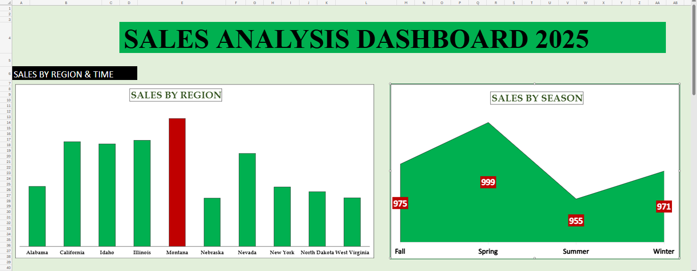
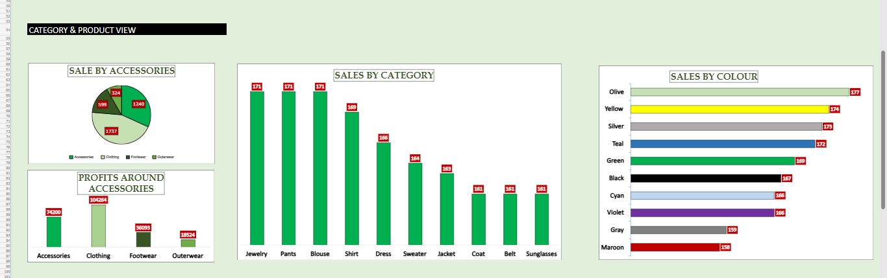
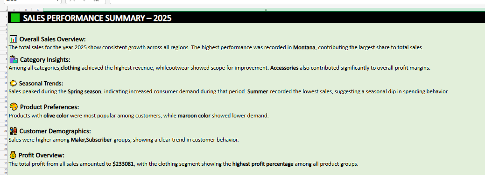
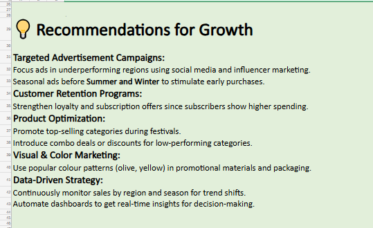

# 📘 Sales Data Analysis Dashboard

This project analyzes sales performance based on multiple dimensions such as **categories, regions, seasons, colors, gender, accessories, and shipping methods**.  
The goal is to visualize key business insights and identify opportunities for growth and optimization.

---

## 📊 Dashboard Overview

### 🔹 Dashboard View 1  
*Sales by  Regions, and Seasons*  

### 🔹 Dashboard View 2  
*Sales by Colors, accessories, and categories*  

### 🔹 Dashboard View 3  
*Sales by subscription,gender and Shipping Methods*  
.png)

---

## 📝 Summary  

**Key Insights:**
- Top-performing categories and regions drive majority of revenue.  
- Certain seasons show noticeable peaks in sales performance.  
- Male and female customer ratios show balanced purchasing trends.  
- Subscriber-based segmentation helps identify loyal customers.  

---

## 💡 Recommendations  

**Suggestions & Insights:**
- Increase **advertising and marketing** in underperforming regions.  
- Focus on **high-demand accessories** to improve profit margins.  
- Optimize **shipping methods** for faster delivery and better satisfaction.  
- Strengthen **online catalog and digital footprint** to boost visibility and conversions.  

---

## 📂 Files Included
- `SalesDashboard.xlsx` — Excel dashboard file  
- `DashboardView1.png`, `DashboardView2.png`, `DashboardView3.png` — Dashboard visuals  
- `Summary.png`, `Recommendation.png` — Summary and insights screenshots  

---

## 🧠 Tools Used
- Microsoft Excel  
- Pivot Tables & Charts  
- Data Cleaning & Visualization  
- Basic Statistical Analysis  

---

## 👩‍💻 Author
**Rafeeda PP**  
📍 INDIA 
📧 rafeedapponline@gmail.com
🗓️ Project Year: 2025  
📍 Data Analyst | Passionate about data visualization and storytelling
---

## ⭐ Project Highlights
This project demonstrates skills in **data cleaning, analysis, visualization, and business insight generation** using Excel — ideal for showcasing analytical thinking and dashboard design capabilities.
